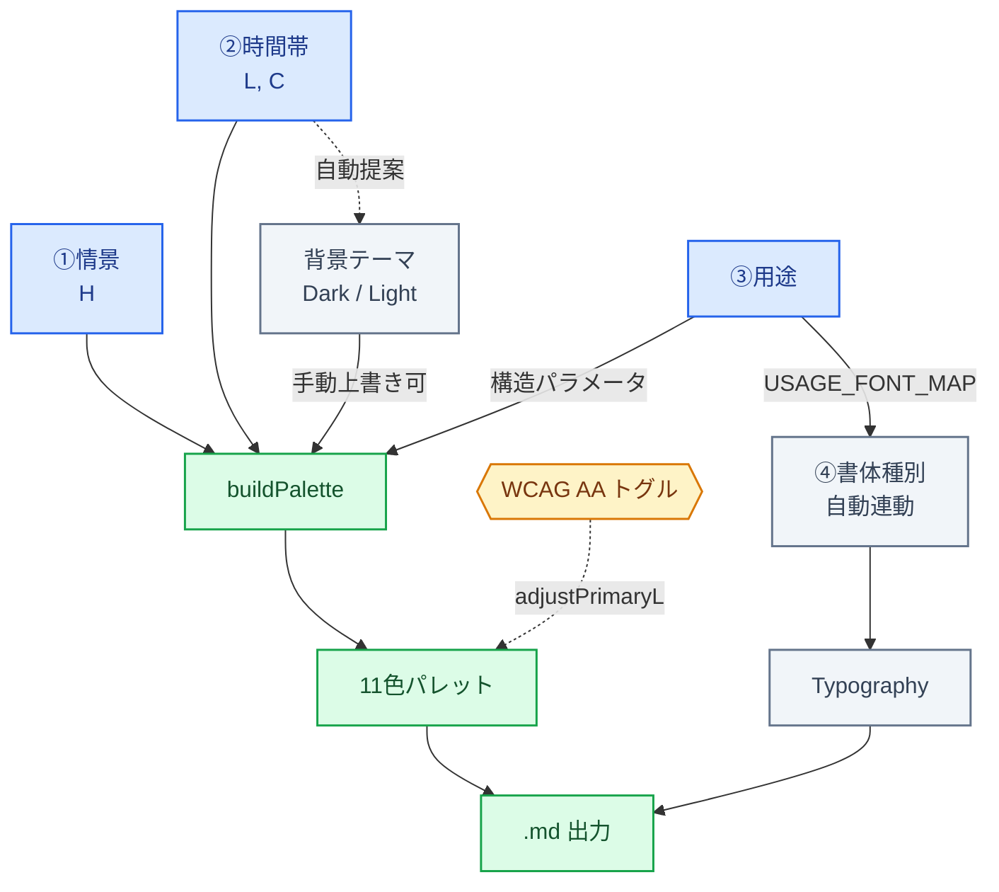

:::message
この記事は「[「清らかな朝のような色」がそのまま色座標になる — 時彩 β4](https://zenn.dev/nekotrack/articles/9613d1a1df1f24)」（前回）の続編です。Ver. 1.0 で追加した3つの技術トピックを記録します。
:::

:::message
時彩は **プロトタイプや個人開発で「AI に渡す前のカラー定義」を整える用途** を想定したツールです。プロダクション用のデザインシステムを置き換えるものではなく、初期検討や個人制作の出発点として使うことを意図しています。本記事の実装も、その前提での設計判断としてお読みください。
:::

## はじめに

カラーシステムを生成するツール「時彩（ときいろ）」を Ver. 1.0 にアップデートしました。

β4 までで実現していたのは「**色を決めること**」でした。情景（Hue）× 時間帯（L/C）でパレットを作って `.md` で書き出す、という流れです。

1.0 で追加したのは、その先にある「**色をどう使うか**」の選択です。具体的には3つ：

1. **用途プリセット**：選んだ用途で `buildPalette` の構造そのものが変わる
2. **書体種別の連動**：用途を選ぶと書体まで自動で決まる
3. **WCAG AA 保証**：primary の **L だけ** を二分探索で動かしてコントラスト比 4.5:1 を担保

順番に実装の中身を書いていきます。



ユーザーが選ぶのは ①情景・②時間帯・③用途 の3つで、④書体種別と背景テーマは自動連動。WCAG AA トグルは破線で示した通り、通常フローの脇から `adjustPrimaryL` で primary の L にだけ介入します。

 [時彩 Ver. 1.0](https://nekotrack.github.io/oklch-plus/tools/TOKIIRO_v1.html)

---

## 1. 用途プリセットによる `buildPalette` の構造差

β4 までの `buildPalette` は「Dark / Light」というテーマ分岐しか持っていませんでした。情景と時間帯が同じなら、出力されるパレットの構造は常に同じ。

1.0 では「用途」を入れて、**同じ色相・明度・彩度でも、用途ごとに異なる構造のパレット**を返すようにしました。

```js
const USAGES = [
  { id:'webui',   label:'Web UI',          sub:'日々の出来事' },
  { id:'market',  label:'マーケティング',  sub:'初めての印象' },
  { id:'a11y',    label:'アクセシビリティ', sub:'誰かのために' },
  { id:'reading', label:'読み物',          sub:'静かな余白'   },
];
```

`buildPalette` の中で用途別に変数を上書きします。

```js
function buildPalette(L, C, h, dark, usage) {
  // 基本値（webui の状態）
  let primL = L, primC = C;
  let bg    = dark ? 0.09 : 0.98;
  let bgC   = 0.015,  sfC  = 0.015,  sf2C = 0.02;
  let textL = dark ? 0.93 : 0.12;
  let brd   = dark ? 0.26 : 0.82;

  if (usage === 'market') {
    // 背景に色みを乗せ、primaryを鮮やかに
    bgC  = 0.028; sfC = 0.022; sf2C = 0.030;
    primC = Math.min(C * 1.15, 0.32);

  } else if (usage === 'a11y') {
    // コントラスト拡大：bg を極端に寄せ、text を遠ざける
    bg    = dark ? 0.06 : 0.99;
    textL = dark ? 0.97 : 0.06;
    brd   = dark ? 0.28 : 0.80;
    if (dark  && primL < 0.55) primL = 0.55;
    if (!dark && primL > 0.42) primL = 0.42;

  } else if (usage === 'reading') {
    // アクセント抑制：中性的な背景、primCを絞る
    bgC  = 0.008; sfC = 0.008; sf2C = 0.010;
    primC = C * 0.65;
  }
  // ... 以下 surface 計算とパレット組み立て
}
```

設計上のポイントは、**「用途」を1パラメータ化したことで、色の方向性を保ったまま全体のトーンを切り替えられるようになった** ことです。

| 用途 | bgC | text-bg L 差 | primary C |
|---|---|---|---|
| webui   | 0.015 | 0.84 | C × 1.00 |
| market  | 0.028 | 0.84 | C × 1.15 |
| a11y    | 0.015 | 0.91 | C × 1.00（L はクランプ） |
| reading | 0.008 | 0.84 | C × 0.65 |

たとえば「マーケティング」では bg に色みを乗せるので、背景自体がブランドカラーの方向に寄ります。「読み物」では bgC を 0.008 まで絞って中性に寄せ、primC を 65% に下げることで、本文を読む邪魔をしないトーンになります。

これは色決定後の **後処理** ではなく、**パレット生成時の分岐** として持たせています。後処理だと用途切り替えのたびに調整が必要ですが、生成時分岐ならフロー上で自然に切り替わります。

---

## 2. 用途 → 書体種別のセマンティック連動

用途を選ぶと、書体も自動で切り替わります。

```js
const USAGE_FONT_MAP = {
  webui:   'gothic',
  market:  'modern',
  a11y:    'ud',
  reading: 'mixed',
};

const FONT_STYLES = [
  { id:'gothic', bodyId:'noto',  headId:'same',   sizeId:'standard' },
  { id:'modern', bodyId:'noto',  headId:'zen',    sizeId:'large'    },
  { id:'ud',     bodyId:'ud',    headId:'ud',     sizeId:'standard' },
  { id:'mixed',  bodyId:'noto',  headId:'mincho', sizeId:'large'    },
];
```

`bodyId` / `headId` は別途定義した `FONT_BODY` / `FONT_HEAD` の id を指していて、`applyFontStyle()` がそこから具体的なフォントファミリーを引いて `--ff-body` / `--ff-head` の CSS 変数にセットします。

書体のマッピングは Web タイポグラフィの一般的な慣習に沿わせています。

- マーケ系 → モダンゴシック（Zen Kaku Gothic New 等）
- アクセシビリティ → UD ゴシック（BIZ UDPGothic）
- 読み物 → 本文ゴシック × 見出し明朝（Shippori Mincho）

ここは「セマンティックフォント」と呼べる発想に近くて、**「色のセマンティクス（primary / bg / surface / ...）」と並列に、「書体のセマンティクス（用途）」を持たせている** 構造です。色だけセマンティクスを持っていて書体は固定、というアンバランスを解消しました。

書体は手動で上書きもできますが、用途を切り替えると一旦推奨値に戻ります。これは「**用途を選んだ意思を尊重する**」設計判断で、毎回手動調整するくらいなら最初から用途で選ばせたほうが軸がブレない、という思想です。

---

## 3. WCAG AA 保証：`adjustPrimaryL` 二分探索

ここからがタイトルにあるL（明度）を動かしてアクセシビリティを確保する話です。

ご存知の通り WCAG 2.x の AA 基準は、文字と背景のコントラスト比 4.5:1 以上（小文字基準）。実務では Figma の Stark プラグインなり WebAIM のチェッカーなりで確認することが多いと思います。

時彩 1.0 では `WCAG AA 保証` トグルを ON にすると、primary が背景に対して 4.5:1 を満たさない場合、**primary の L だけを動かして自動的に 4.5:1 を達成する** 処理を入れました。

**ポイントは「L だけ動かす」こと。** C（彩度）と h（色相）は固定です。

### なぜ L だけ動かせるのか

OKLCH の L は **L\* に近い知覚均等な明度軸** で、相対輝度（WCAG が定義する Y）はおおよそ L の単調増加関数になります。**C と h を固定すれば、L を動かすことでコントラスト比は単調に変化** します。

これは HSL では成立しません。HSL の L は色相によって輝度寄与が大きく変わるので、L を上げると黄色は明るくなりますが、青はそれほど明るくなりません。同じ L 値でも色相次第で輝度がまったく違うので、「L だけ動かす」戦略が機能しません。

OKLCH を使っているからこそ、**色のアイデンティティ（C, h）を保ったまま、可読性（L 経由のコントラスト）だけを担保する分離** ができます。

### 二分探索の実装

単調性があるので、二分探索が刺さります。

```js
function adjustPrimaryL(primL, primC, h, bgL, bgC, bgH, dark) {
  const ratio = wcagRatio(primL, primC, h, bgL, bgC, bgH);
  if (ratio >= 4.5) return primL;  // 既に AA 通過

  if (dark) {
    // 暗背景 → primary を明るく
    let lo = primL, hi = 0.99;
    for (let i = 0; i < 32; i++) {
      const mid = (lo + hi) / 2;
      wcagRatio(mid, primC, h, bgL, bgC, bgH) >= 4.5
        ? (hi = mid) : (lo = mid);
    }
    return hi;
  } else {
    // 明背景 → primary を暗く
    let lo = 0.01, hi = primL;
    for (let i = 0; i < 32; i++) {
      const mid = (lo + hi) / 2;
      wcagRatio(mid, primC, h, bgL, bgC, bgH) >= 4.5
        ? (lo = mid) : (hi = mid);
    }
    return lo;
  }
}
```

32 回反復で精度は 2^-32 ≈ 2.3×10^-10、L のスケールでは過剰なほどです。実用上は 24 回程度で十分ですが、コスト的にトグル ON/OFF 時の1回計算なので 32 で固定しました。

`wcagRatio` は OKLCH を linear sRGB に展開して相対輝度を計算する標準的な実装です。

```js
function wcagLuminance(L, C, h) {
  const lin = oklchToLin(L, C, h);  // linear sRGB
  return 0.2126 * Math.max(0, lin[0])
       + 0.7152 * Math.max(0, lin[1])
       + 0.0722 * Math.max(0, lin[2]);
}

function wcagRatio(L1, C1, h1, L2, C2, h2) {
  const y1 = wcagLuminance(L1, C1, h1);
  const y2 = wcagLuminance(L2, C2, h2);
  const lighter = Math.max(y1, y2);
  const darker  = Math.min(y1, y2);
  return (lighter + 0.05) / (darker + 0.05);
}
```

### 単調性と滑らかさ

OKLCH → linear sRGB の変換は三次多項式構造なので、Y(L) は L について理論的には非単調になり得ます。ただし数値検証では、非単調が起こる位置は L ≈ 0.02〜0.20 の暗領域に集中し、振幅は彩度 C ≲ 0.2 で 0.5% 以下と小さくなります。時彩で扱う primary の典型 L 範囲（0.42〜0.68）では実用上問題なく二分探索が収束することを確認しています。
Math.max(0, ...) のクリップは滑らかさ（C¹ 連続性）を壊しますが、単調性そのものを直接破壊するわけではありません。
より厳密には、二分探索の前段でガマットマッピング（C を制約する）を入れる選択肢もありますが、今回は 「色のアイデンティティを最大限保つ」方を優先 して、C は触らず L の動きでカバーする設計にしました。


### 本番用途との切り分け

このトグルは「ブランドカラーの方向性を保ったまま、ざっくり 4.5:1 を担保する」プロトタイピング用途を想定しています。本番プロダクトで厳密な WCAG 適合（AAA 評価、フォントサイズ別の閾値切り替え、状態別コントラストのドキュメンテーション等）が必要なら、専用のアクセシビリティ検証ツールやデザインシステムが別途必要です。

時彩で生成した `.md` は、そうした本番デザインシステムを組む前の **叩き台** として使うのが想定されている関係です。

### ユーザー側へのフィードバック

調整が走ったときは UI 側で `✦ ΔL +0.142 調整済み` のようにどれだけ動いたかを表示します。WCAG の各テキスト × 背景の組み合わせも 4.5:1 / 3:1 で評価して、AAA / AA / FAIL を視覚化しています。

これは **「自動で動いたものを目視で確認できる」設計** で、開発者が後で「なぜこの L になっているのか」をトレースできる状態を保ちたかった意図です。

---

## 補足：単一 HTML としての設計

時彩は意図的に **単一の HTML ファイル** として実装しています。

- 外部依存は Google Fonts のみ（CDN）、CSS/JS は全てインライン
- GitHub リポジトリから HTML ファイルを直接ダウンロード可能（Raw → 保存）
- ブラウザの「名前を付けてページを保存」→「Web ページ、HTML のみ」でも保存可能
- サーバー不要、任意の static ホスティングで配信可能

これは「プロトタイプ・個人開発向け」という位置づけと一貫していて、たとえばインターネット環境のない場所で配色だけ詰めたい、長期保存しておきたい、というケースに対応できます。AI ツール群がクラウド前提のものが多い中、**ローカルで完結する色決定ツール** を1つ持っておく、というのは現実的な選択肢になります。

> Google Fonts はオフライン時にシステムデフォルトフォントへフォールバックしますが、配色決定や `.md` 書き出しといったコア機能には影響しません。

---

## おわりに

Ver. 1.0 で増えたのは、**選択肢を絞ることで決定コストを下げる**仕組みです。色だけでなく用途と書体まで、フローに沿って選ぶだけで一連の `.md` が生まれる。AI に渡したときの再現性が上がる。

これらは「カラーシステムの正解」を提案するものではなく、**個人開発の現場で AI 相手に作業するときの摩擦を減らす設計判断** として組み込んでいます。OKLCH を採用したことで、用途別の構造分岐も、L 単軸でのコントラスト調整も、比較的素直に実装できました。

プロトタイプや個人制作の「AI に渡す前の整理」としては、これくらいで十分回るのではないかと考えています。本番のデザインシステムを組む前段階の叩き台、くらいの位置づけでお試しください。

体験面の話は note のほうに書きました。

 [色を「決める」から「整える」へ — 時彩 1.0 で見えた、AI に渡す前の準備（note）](https://note.com/nekotrack/n/n0c2863524cd8)
 

---

